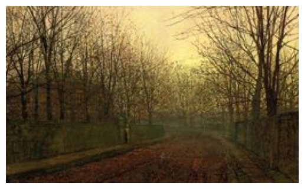
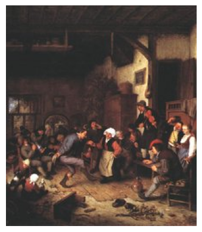
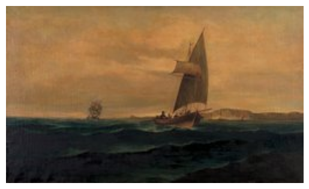

# MUSE: Multimodal Understanding of Sentiments and Expressions

A multimodal encoder-decoder model that takes a painting as input and generates a natural language description of the emotional response it evokes.

---

## Overview

MUSE combines a pretrained CNN image encoder with a Transformer text decoder connected via cross-attention. Given a painting, the model generates a caption describing the feeling the artwork conveys, i.e. how it makes the viewer feel.

**Dataset:** [ArtEmis](https://www.artemisdataset.org/) — 49,000+ emotion-annotated utterances across 19,000 WikiArt paintings, covering 9 emotion labels (amusement, awe, contentment, excitement, fear, sadness, disgust, anger, something else).

## Installation

```bash
git clone https://github.com/wayneyu-kellogg/muse.git
cd muse

# Create and activate a virtual environment
python -m venv .venv
source .venv/bin/activate

# Install dependencies
pip install torch torchvision --index-url https://download.pytorch.org/whl/cu121
pip install pandas Pillow scikit-learn tqdm kaggle
```

### Download the dataset

```bash
mkdir -p data
kaggle datasets download -d rollas/artemis-dataset-including-10k-images -p data --unzip
```

---

## Training

### Train Script

```bash
python train.py --num-epochs 20 --skip-download
```

Key arguments:

| Argument | Default | Description |
|---|---|---|
| `--num-epochs` | 20 | Number of training epochs |
| `--batch-size` | 64 | Batch size |
| `--lr` | 1e-4 | Learning rate |
| `--weight-decay` | 1e-4 | L2 regularisation |
| `--label-smoothing` | 0.1 | Label smoothing factor |
| `--num-layers` | 3 | Number of Transformer decoder layers |
| `--d-model` | 512 | Model hidden dimension |
| `--skip-download` | — | Skip Kaggle download if data already exists |
| `--resume` | — | Path to checkpoint to resume from |

Checkpoints are saved to `checkpoints/` after every epoch. The best validation-loss checkpoint is saved separately as `checkpoints/best_checkpoint.pt`.


### Running in a notebook

Open `notebooks/train.ipynb`. All training phases — EDA, preprocessing, model definition, training loop, and qualitative evaluation — are in a single notebook.

---

## Results

### Qualitative examples

| Painting | Generated caption | Ground truth |
|---|---|---|
|  | *"the dark shadows and the trees make it look like a scary place to be"* | *"The colors are dark and dreary like smoke is in the air, and the dark path looks like it goes somewhere ominous."* |
|  | *"the people look like they are having a good time together"* | *"The people are crowded into the damp, dusky room and there are no lights in the rafters."* |
|  | *"the ship looks like it is about to sink"* | *"The waves are so high that they can overtake this ship."* |

---

## Extra Criteria: Multimodal Model

MUSE qualifies under the multimodal model extra criterion by combining two modalities of images and text.

---

## Challenges & Solutions

### 1. Cross-attention collapse
**Problem:** After training with a from-scratch CNN encoder, the model produced repetitive outputs like "when when when when...". Diagnosis revealed the spatial tokens from the CNN were nearly identical within each image and indistinguishable across images. The model effectively ignored the image inputs.

**Solution:** Replaced the scratch CNN with a pretrained ResNet-18 (ImageNet weights, backbone frozen). The pretrained backbone produces spatially varied 7×7 feature maps immediately, enabling meaningful cross-attention. Training loss convergence slowed since the model is now actually using the image, and the repetition problem disappeared.

---

### 2. Overfitting
**Problem:** Validation loss plateaued and began rising (~epoch 7) while training loss continued to decrease, with a widening train/val gap.

**Solution:**
- **Label smoothing** (`label_smoothing=0.1`) on the cross-entropy loss — prevents overconfident predictions
- **Weight decay** (`weight_decay=1e-4`) on the Adam optimiser — L2 regularisation on all parameters
